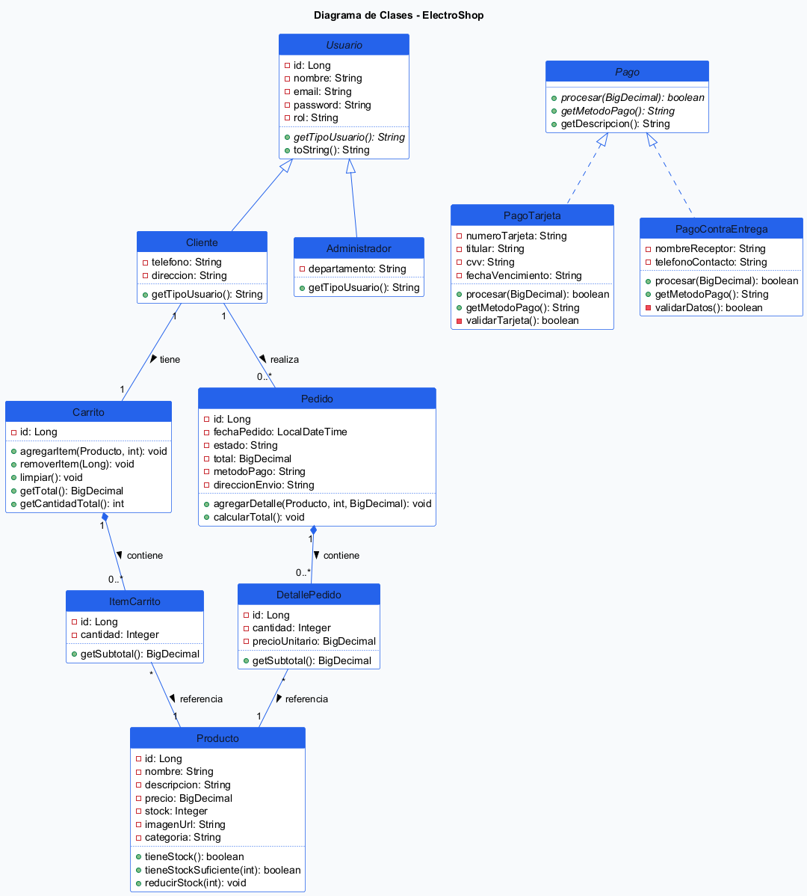
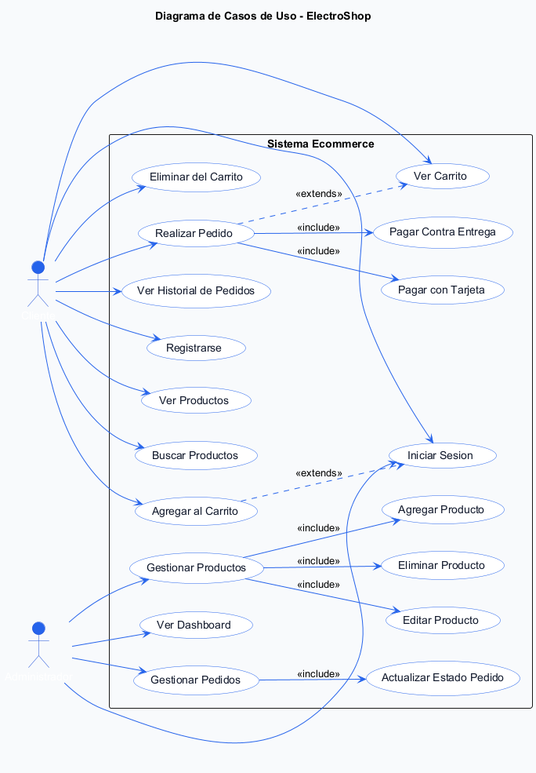

# 🛒 [ELECTRONIC STORE]

> Taller Competitivo — Java POO · [Curso] · [2026]

## 👥 Integrantes

| Nombre | GitHub |
|--------|--------|
| [Roy] | [@iTsRoys-Maker](https://github.com/iTsRoys-Maker) |
| [Duvan] | [@DuvanCastilloDeveloper](https://github.com/DuvanCastilloDeveloper) |
| [Alvaro] | [@AlvaroToloza](https://github.com/AlvaroToloza) |
| [Adrian] | [@adriannavas14g-beep](https://github.com/adriannavas14g-beep) |

---

## 📋 Descripción

**ELECTRONIC STORE** es una plataforma de comercio electrónico desarrollada como parte de un taller competitivo de Programación Orientada a Objetos. El sistema permite la gestión integral de productos, usuarios y pedidos, ofreciendo una experiencia de compra fluida con persistencia de datos robusta y una interfaz moderna.

---

## 🚀 Cómo ejecutar

### Requisitos
- **Java JDK 17+**
- **Maven 3.8+**
- **MySQL 8.0+**
- **Navegador Web Moderno**

### Pasos
1. **Clonar el repositorio**
   ```bash
   git clone https://github.com/iTsRoys-Maker/Competencia-Developer-s.git
   ```

2. **Configurar la base de datos**
   - Crear una base de datos llamada `ecommerce_poo` en MySQL.
   - Ajustar las credenciales en `backend/src/main/resources/application.properties` si es necesario.

3. **Ejecutar el backend**
   - Desde la carpeta `backend`:
   ```bash
   mvn spring-boot:run
   ```

4. **Acceder a la aplicación**
   - Abrir `http://localhost:8080` en el navegador.

---

## 🏗️ Tecnologías usadas

| Categoría | Tecnología elegida |
|-----------|-------------------|
| Lenguaje | Java 17 |
| Framework Backend | Spring Boot 3.x |
| Frontend | Vanilla JS, CSS3, HTML5 |
| Persistencia | MySQL |
| Seguridad | JWT (JSON Web Tokens) |
| IDE | VS Code / IntelliJ IDEA |

---

## 🧩 Diagrama de clases UML



---

## 📐 Diagrama de casos de uso



---

## 🎯 Funcionalidades implementadas

- [x] **Autenticación segura**: Sistema de login y registro basado en JWT.
- [x] **Gestión de productos**: Catálogo dinámico con categorías y detalles.
- [x] **Carrito de compras**: Gestión de ítems persistente por sesión de usuario.
- [x] **Flujo de pedido**: Generación de órdenes con numeración única.
- [x] **Historial de pedidos**: Vista detallada de compras anteriores.
- [x] **Panel de Administración**: Control de inventario y pedidos para administradores.
- [x] **Persistencia de datos**: Implementación completa con Spring Data JPA y MySQL.

---

## 📐 Conceptos POO aplicados

| Concepto | Aplicación |
|----------|------------|
| **Herencia** | Implementada en la estructura de Usuarios y Roles. |
| **Encapsulación** | Uso de modificadores de acceso y DTOs para protección de datos. |
| **Polimorfismo** | Aplicado en servicios y repositorios genéricos. |
| **Abstracción** | Definición de interfaces para servicios desacoplados. |
| **Colecciones** | Uso intensivo de `List`, `Set` y `Map` para gestión de datos en memoria. |
| **Excepciones** | Manejo global de errores mediante `@ControllerAdvice`. |

---

## 🖼️ Capturas

*(Próximamente se añadirán capturas de la interfaz de usuario)*

---
